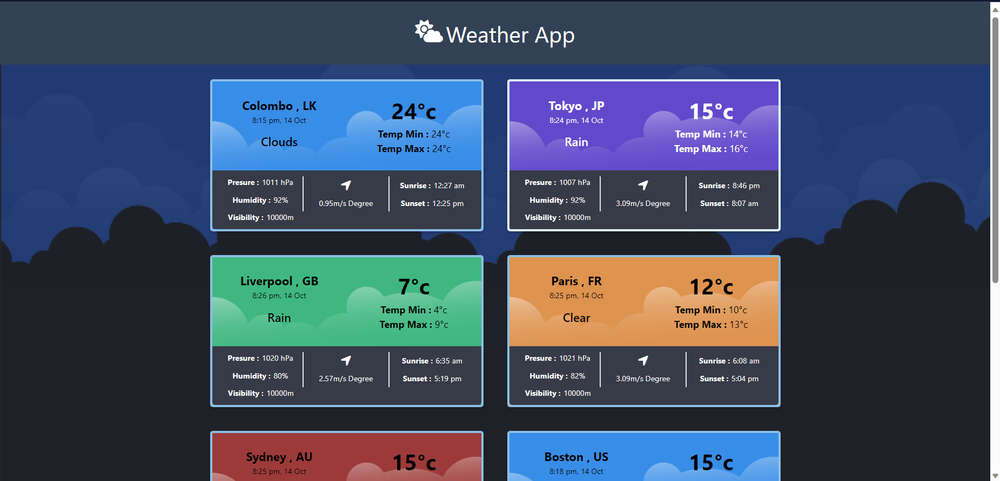

# Weather_App
This is a Vue application to view real-time weather of a few cities

<h1> API KEY of openweathermap.org </h1>
My personal Api key is not shared.  
Create a .env file in the project folder (vue-project  ---> .env) like in .env.example  
Then add your own key to a variable named VITE_APP_API_KEY

eg:
VITE_APP_API_KEY= 00000000000000
<!-- replace 00000000000000 with api key  -->
Add your api key replacing "00000000000000" in the created .env file  
Note: the application will not work without the VITE_APP_API_KEY

<h2>Commands for docker:</h2>

"docker build -t image-1 ."
(replace image-1 with the image name you want)

"docker run -it -p --rm --name vueapp-1 image-1"
(replace vueapp-1 with a name you want)

Then go to the browser and go to "localhost:8080" <be>

